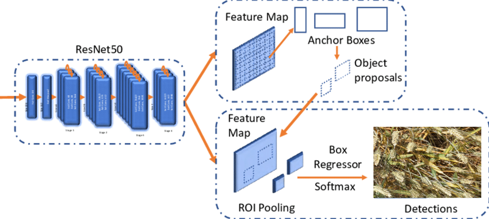
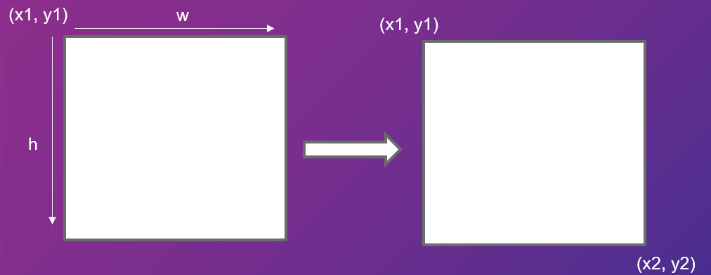

# The Model

The faster R-CNN Resnet50 is a model that uses a Resnet50 convolutional
layer for the backbone which is the first convolutional layer applied on
the input image. Resnet50 has 50 layers and uses the ReLu activation
function.

You can find the paper from which the model is from
[here](https://arxiv.org/pdf/1506.01497)

# The Dataset

I used the Wheat head detection dataset available on Kaggle to perform
my model with a binary classification (head or background). This dataset
has 3422 images and the information about the bounding boxes that we
have are the top-left corner coordinates and the width and height of the
bounding boxes.

{width="0.6\\linewidth"}

The problem is that the model needs to have the top-left and bottom
right corners coordinates to be trained and evaluated.

{width="0.6\\linewidth"}

Thus, I transformed my dataset to by applying these operations on every
bounding boxes of every images :

$$X2 = X1 + W$$ $$Y2 = Y1 + H$$

{width="0.6\\linewidth"}

# Training the Model

I trained the model with different values of learning rates, batch size,
weight decay. The best that I had for the presentation was the training
using these values :

-   Batch Size : 16

-   Learning Rate : 0.0001

-   Weight Decay : 0.001

{width="0.6\\linewidth"}

I ran more tests after the presentation and by using a learning rate of
0.00001 I got a better result :

{width="0.6\\linewidth"}

# Evaluate the Model

To evaluate the model I drew the bounding boxes predicted by the model
after using the nonMaxSupression function with different values of
threshold. Here is one result with a threshold of 0.5.

{width="0.6\\linewidth"}
